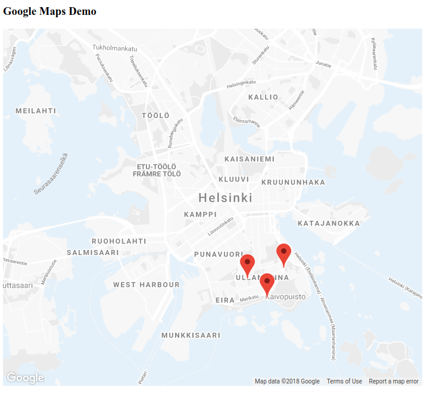

# Using Google Maps in web page



## Usage

Open `maps.html` in browser

## Tips

**Markers** 

* onClick listeners
* use google documentation for styling
* sample data for markers:

```
{
  "stations": [
    {
      "name": "Kaivopuisto",
      "total_slots": 30,
      "lat": "60.155411",
      "lon": "24.950391",
      "stationId": "001"
    },
    {
      "name": "Laivasillankatu",
      "total_slots": 12,
      "lat": "60.159715",
      "lon": "24.955212",
      "stationId": "002"
    },
    {
      "name": "Kapteeninpuistikko",
      "total_slots": 16,
      "lat": "60.158172",
      "lon": "24.944808",
      "stationId": "003"
    }
  ]
}
```